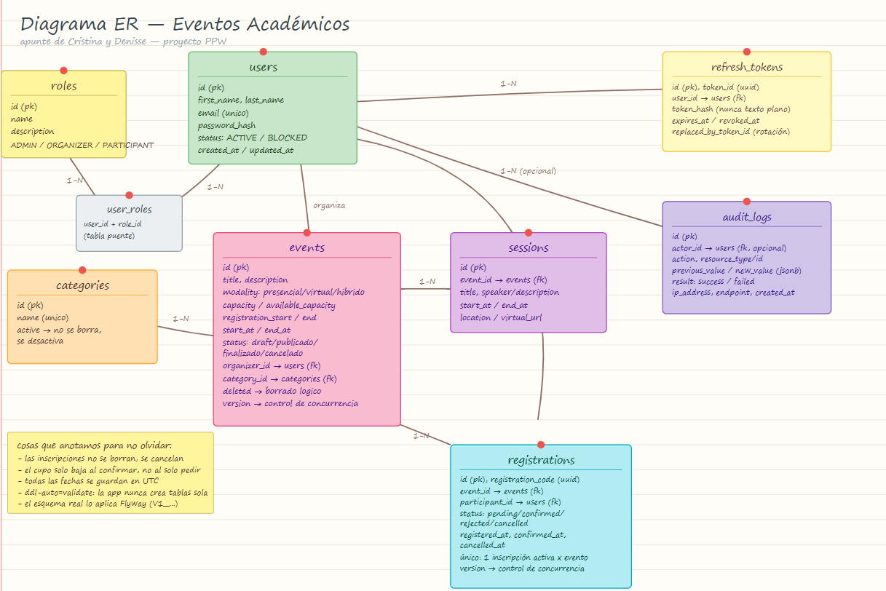

# Sistema de Gestión de Eventos Académicos - API REST

Proyecto integrador de la materia Programación y Plataformas Web (PPW), Universidad Politécnica Salesiana.

Hecho por: 

**Cristina Loja** **clojap1@est.ups.edu.ec** 

y

**Denisse Paredes** **dparedesp5@est.ups.edu.ec**

## De qué se trata

Es una API para que una institución pueda organizar sus eventos académicos: conferencias, talleres, seminarios. Hay tres tipos de usuario (administrador, organizador y participante) y cada uno puede hacer cosas distintas: el admin maneja usuarios y categorías, el organizador crea y publica sus propios eventos, y el participante se inscribe a los que le interesen. Todo protegido con JWT, con límites de peticiones usando Redis para que no se pueda abusar del login, y con reportes descargables en PDF y Excel.

La hicimos en Spring Boot (versión 4.1, con Java 25) porque así lo pedía la práctica, usando Gradle en vez de Maven.

## Enlaces

- API en producción: https://academic-events-api-5eto.onrender.com
- Documentación Swagger: https://academic-events-api-5eto.onrender.com/swagger-ui.html
  - usuario: `evaluador` / clave: `evaluador123`
- Repo: https://github.com/cristinaelilo/icc-ppw-proyecto-final

Para probar rápido, este usuario ya viene creado en la base de datos con rol ADMIN:
```
admin@academic.test / Password123*
```

Dos cosas que vale la pena saber antes de entrar:
- Render (el hosting gratuito que usamos) "duerme" el servicio si nadie lo usa por 15 minutos. La primera petición después de eso tarda como medio minuto en responder mientras despierta. No es que esté roto, solo se demora.
- Si entran directo a la URL sin nada más (`.../`) les va a salir un 404. Es normal, ahí no hay nada montado, es una API no un sitio web. Hay que ir a `/swagger-ui.html` para ver algo, o pegarle directo a los endpoints de `/api/...`.

## Cómo está organizado el código

Decidimos separar todo por dominio (auth, eventos, categorías, etc.) y dentro de cada dominio por capa:

```
domain/
  auth/
    controllers/
    services/
    dto/
    model/
    repository/
  event/
    controllers/
    services/
    dto/
    model/
    repository/
  ... (category, session, registration, user, report, audit siguen el mismo patrón)
```

Así todo lo relacionado a "eventos" está junto en su carpeta, en vez de tener que andar saltando entre una carpeta general de controllers, otra de services, etc.

## La base de datos

Las tablas principales son: `users`, `roles`, `user_roles`, `categories`, `events`, `sessions`, `registrations`, `refresh_tokens` y `audit_logs`. Las creamos con los scripts SQL que dio el profesor, y las migraciones corren con Flyway (la app tiene `ddl-auto=validate`, o sea que nunca toca el esquema sola, solo valida que coincida).

Cosas del modelo que quizás no se ven a simple vista:
- Los eventos y las categorías no se borran de verdad, se marcan como inactivos/eliminados (`active` y `deleted`). Un evento que ya está publicado o terminado no se puede eliminar aunque sea lógicamente, primero hay que cancelarlo.
- Las inscripciones no quedan confirmadas al toque. Quedan en `PENDING` y el organizador tiene que aprobarlas (`CONFIRMED`) o rechazarlas (`REJECTED`). El cupo del evento (`available_capacity`) solo se descuenta cuando se confirma, no cuando se solicita.
- Para que dos organizadores no puedan confirmar al mismo tiempo el último cupo disponible y se rompa todo, usamos bloqueo de fila (`SELECT ... FOR UPDATE`) al momento de confirmar o cancelar.

El diagrama entidad-relación está en:


## Seguridad

El login devuelve dos tokens: uno de acceso que dura poco (15 minutos) y uno de refresco que dura una semana y se puede usar para pedir uno nuevo sin volver a meter la contraseña. El refresh token se guarda hasheado en la base (nunca en texto plano) y cada vez que se usa se revoca y se genera uno nuevo, para que si alguien roba un token viejo ya no le sirva.

Si el correo no existe o la contraseña está mal, el mensaje de error es el mismo en los dos casos, para no darle pistas a quien intenta adivinar contraseñas.

Con Redis limitamos:
- 5 intentos de login por minuto (por IP + correo)
- 3 registros por hora (por IP)
- 60 peticiones por minuto para quien no está logueado
- 120 peticiones por minuto para quien sí está logueado
- 5 reportes por minuto
- Si alguien falla el login 5 veces seguidas, se bloquea 15 minutos

Swagger y la documentación OpenAPI están protegidos con usuario/clave aparte (no es lo mismo que el login normal de la API). Y el Actuator solo expone `/health`, nada más.

## Endpoints

**Auth**
```
POST /api/auth/register
POST /api/auth/login
POST /api/auth/refresh
POST /api/auth/logout
GET  /api/auth/me
```

**Categorías**
```
GET    /api/categories
GET    /api/categories/{id}
POST   /api/categories                  (solo admin)
PUT    /api/categories/{id}              (solo admin)
PATCH  /api/categories/{id}/activate     (solo admin)
PATCH  /api/categories/{id}/deactivate   (solo admin)
```

**Eventos**
```
GET    /api/events            (cualquiera ve los publicados; admin ve todos)
GET    /api/events/mine       (organizador ve los suyos, en cualquier estado)
GET    /api/events/{id}
POST   /api/events            (organizador o admin)
PUT    /api/events/{id}       (el dueño o admin)
PATCH  /api/events/{id}/publish
PATCH  /api/events/{id}/cancel
PATCH  /api/events/{id}/finish
DELETE /api/events/{id}
```

**Sesiones** (dependen de un evento)
```
GET    /api/events/{eventId}/sessions
POST   /api/events/{eventId}/sessions
PUT    /api/events/{eventId}/sessions/{id}
DELETE /api/events/{eventId}/sessions/{id}
```

**Inscripciones**
```
POST  /api/registrations/events/{eventId}   (participante pide inscribirse)
PATCH /api/registrations/{id}/confirm        (organizador aprueba)
PATCH /api/registrations/{id}/reject         (organizador rechaza)
PATCH /api/registrations/{id}/cancel         (participante o admin cancela)
GET   /api/registrations/me
GET   /api/registrations/events/{eventId}
```

**Usuarios** (todo solo para admin)
```
GET    /api/users
GET    /api/users/{id}
PATCH  /api/users/{id}/block
PATCH  /api/users/{id}/unblock
POST   /api/users/{id}/roles
DELETE /api/users/{id}/roles/{role}
```

**Reportes**
```
GET /api/reports/events/{eventId}/registrations.pdf
GET /api/reports/events/{eventId}/registrations.xlsx
GET /api/reports/registrations/{id}/certificate.pdf
```

## Cómo correrlo en tu máquina

Necesitas Docker instalado.

```bash
git clone https://github.com/cristinaelilo/icc-ppw-proyecto-final.git
cd icc-ppw-proyecto-final
docker compose up -d --build
```

Eso levanta Postgres, Redis y la API. Falta crear la base de datos (Docker no la crea sola):

```bash
docker exec -i postgres-dev psql -U ups -d postgres -f /dev/stdin < 00_create_database.sql
```

Con la base creada, al arrancar la app Flyway mete solo todo el esquema y los datos de prueba. Para confirmar que quedó bien:

```
http://localhost:8080/actuator/health
```

Debería responder `{"status":"UP"}`.

## Variables de entorno

Están en `.env.example`. Las importantes son la conexión a la base de datos, la de Redis, el secreto para firmar los JWT, y las credenciales de Swagger. En Render la conexión a la base se arma con `DB_HOST`, `DB_PORT` y `DB_NAME` por separado (porque la cadena de conexión que da Render por defecto no trae el prefijo `jdbc:` que necesita Spring, tuvimos que armarla nosotras manualmente).

## Tests

```
./gradlew test
```

Tenemos pruebas con JUnit y Mockito para lo que consideramos más delicado del proyecto: el login (que no revele si el correo existe o no, que bloquee cuentas), y las inscripciones (que no se pueda inscribir dos veces, que no deje confirmar sin cupos, que respete la ventana de fechas).

## Despliegue

La API está en Render, la base de datos también (Render la crea automática), y Redis lo tenemos en Upstash porque Render no da Redis gratis de forma directa. Todo conectado por variables de entorno, nada quemado en el código.

## Algunas cosas que nos costaron y aprendimos en el camino

Vale la pena dejarlo anotado por si a alguien más le pasa lo mismo:

- Al usar Spring Boot 4 con Redis en producción (Upstash, que usa TLS), tuvimos que agregar `ssl.enabled` en la configuración de Redis, porque por defecto Spring intenta conectar sin cifrado y Upstash lo rechaza.
- Cambiamos la librería de JWT de Jackson a Gson (por un conflicto con Jackson 3 que trae Boot 4), y eso hizo que los números dentro del token llegaran como decimales (`1.0` en vez de `1`), rompiendo la autenticación. Tocó pedir el valor explícitamente como `Number` y convertirlo a `Long` a mano.
- En Spring Boot 4, tener solo la librería de Flyway en las dependencias ya no alcanza para que se ejecute solo al arrancar; hay que agregar el starter específico (`spring-boot-starter-flyway`).
- Render entrega la URL de conexión a Postgres sin el prefijo `jdbc:`, así que tuvimos que armar la URL nosotras mismas con el host, puerto y nombre de la base por separado.

## Bruno

La colección con todos los endpoints se mostrará a continuación:

